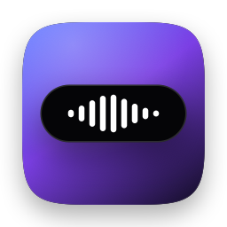
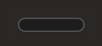
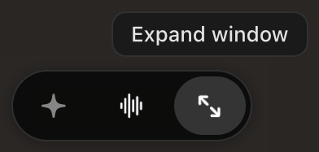
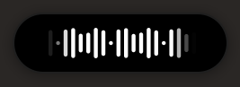
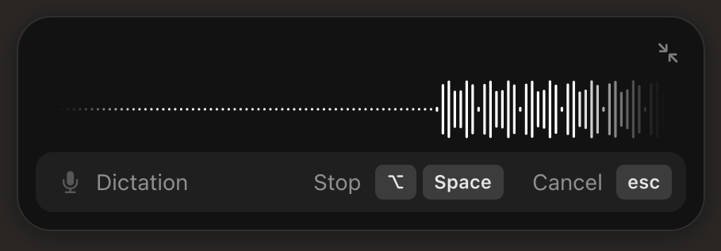
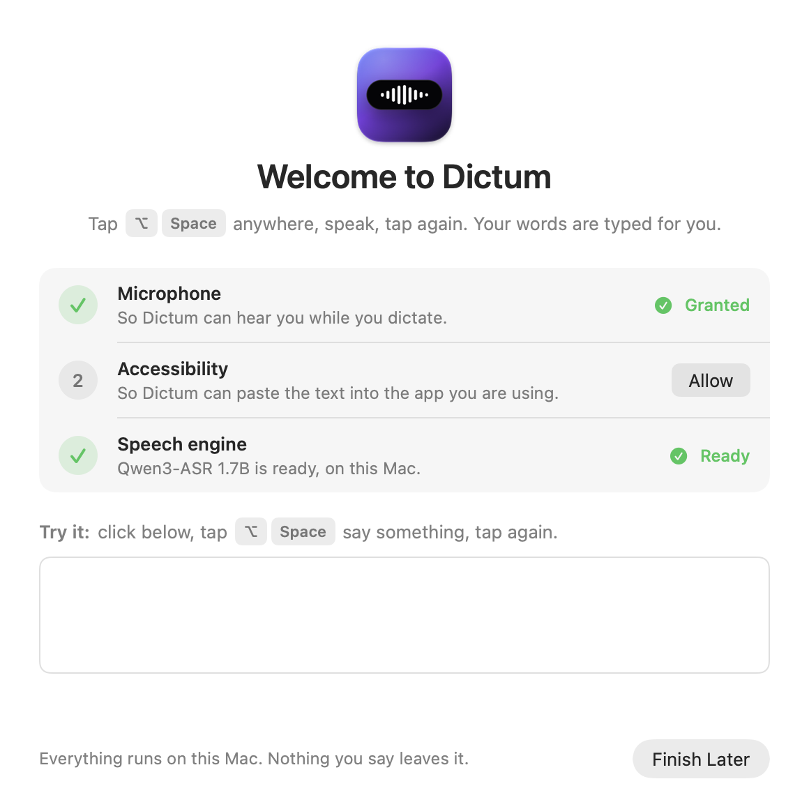
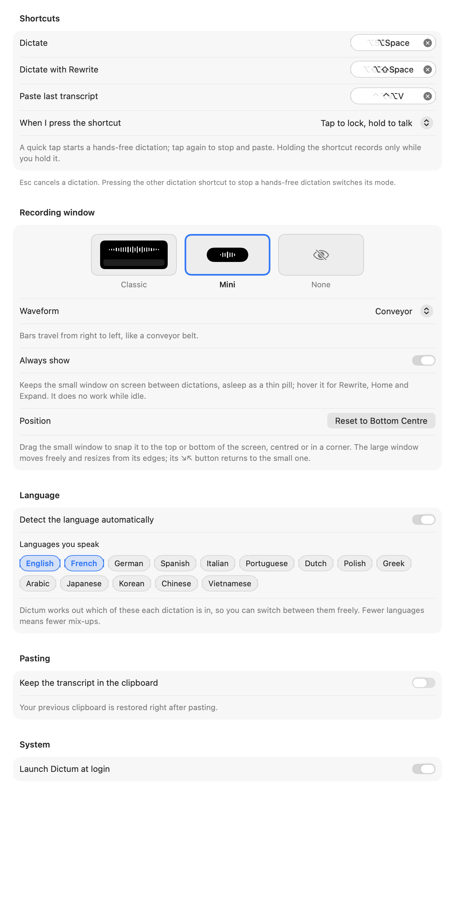

<p align="center"></p>

<h1 align="center">Dictum</h1>

<p align="center">Tap a shortcut, speak as long as you like, tap again — your words are typed into whatever app you're in.<br>
On-device dictation for Apple Silicon Macs: Qwen3-ASR or Cohere Transcribe for speech, Tiny Aya for cleanup.</p>

<p align="center"> &nbsp;  &nbsp;  &nbsp; </p>

## Features

- **Tap ⌥Space, speak hands-free, tap again.** Text is pasted at your cursor and your clipboard is restored.
  - Holding the shortcut works too: it records while held and pastes when you let go.
  - Esc cancels.
- **Speaks your languages.** Dictum detects the language phrase by phrase, so one dictation can switch between French and English. Works with 14+ languages.
- **Fully on-device, with a choice of speech models.** All run locally with MLX; nothing leaves your Mac.
  - **Qwen3-ASR 1.7B** (default): most accurate, detects the language, uses your Vocabulary.
  - **Cohere Transcribe**: fastest and lightest.
  - **Nemotron**: smallest download.
- **Rewrite mode.** Hold ⌥⇧Space, or make Rewrite the default, and Tiny Aya removes fillers, false starts and self-corrections. If its rewrite drifts from what you said, Dictum pastes your plain transcript instead.
- **Vocabulary:** teach Dictum names and terms. Qwen3 uses them as hints, and every transcript is corrected with them.
- **Recording window**, fully opaque while recording:
  - **Small window:** sleeps as a thin pill. Hover it for ✦ Rewrite, Home and ⤢ Expand. Drag it to snap to a screen edge or corner.
  - **Large window:** moves freely and resizes from its edges.
- **Seven waveform styles:** Conveyor (default), Ripple, Wave, Equalizer, Ribbon, Aurora and Dot Matrix.
- **Home window:**
  - Words per minute, words, apps used, time saved, an activity chart, languages and top apps.
  - Pages for Modes, Vocabulary, Configuration, Sound, the Models library, History and Training data.
- **History** is grouped by day and keeps both the rewrite and the original. Failed dictations keep their audio so you can retry them. **Paste Last** is on ⌃⌥V.
- **Training data (optional).** Saves each dictation's audio and word-for-word transcript as a Hugging Face "audiofolder" dataset. Correct transcripts, then export to fine-tune a model on your voice.
- **Light on resources:** 0 % CPU and no wakeups between dictations. See [Resource use](#resource-use).

<p align="center"> </p>

## Requirements

- An Apple Silicon Mac running macOS 14 or later
- [uv](https://docs.astral.sh/uv/) (`brew install uv`) or Python 3.13+. Dictum uses it once to create a private Python runtime.
- Disk: 2.5 GB for the default speech model (Qwen3), plus 2 GB for Rewrite (a 3.6 GB download).

## Install

1. Download `Dictum.zip` from [Releases](../../releases), unzip it, and move **Dictum.app** to Applications.
2. Open it. Dictum isn't notarized yet, so the first time macOS will refuse. Go to **System Settings → Privacy & Security** and click **Open Anyway**.
3. The welcome window walks you through **Microphone** and **Accessibility** access, then installs the speech engine with one click.
   - Accessibility is what lets Dictum paste. Without it, transcripts are only copied.
   - If pasting stops working after an update, use **Reset Permission** on the Home page.

Dictum lives in the menu bar (the waveform icon). It has no Dock icon.

## Speech models

Benchmarked on real English and French speech (Google FLEURS) plus mixed-language and dictation-style takes, on an M4 Pro:

| Model | WER EN / FR | Mixed FR+EN in one take | Detects language | Vocabulary hints | 10 s take | Memory |
|---|---|---|---|---|---|---|
| **Qwen3-ASR 1.7B** (default) | **3.3 % / 5.2 %** | ✓ (with pause splitting) | ✓ | ✓ | 0.6 s | ~2.5–3 GB |
| Cohere Transcribe (4-bit) | 4.8 % / 5.6 % | ✗ drops or translates one language | — (Dictum detects from the text) | — | 0.2 s | ~1.6–1.9 GB |
| Nemotron 3.5 Streaming | 9.8 % / 12.8 % | ✓ | ✓ | — | 0.3 s | ~1.6 GB |

- **Mixed-language takes.** Dictum splits a take at clear pauses (0.8 s or more) and transcribes each stretch on its own. On mixed takes this cut the word error rate from 15 % to 3.4 %, without changing single-language accuracy.
- **Re-quantizing.** Cohere Transcribe is re-quantized from int8 to 4-bit locally. This gives the same accuracy with 0.9 GB less RAM.

## Build from source

```sh
brew install xcodegen uv
make install      # Release build → /Applications/Dictum.app, then launch it
make run          # Debug build, run from build/
make release      # Release build zipped to build/Dictum.zip
```

The Makefile signs with your Apple Development certificate when it finds one, so macOS privacy grants survive rebuilds. Without one, it signs ad-hoc.

## How it works

```
Dictum.app (Swift)                              dictum_helper.py (Python, MLX)
 ├ hotkeys (KeyboardShortcuts)                   ├ speech model, kept loaded (Qwen3 / Cohere / Nemotron)
 ├ AVAudioEngine → 16 kHz WAV on disk ─ Unix ──▶ ├ pause splitting, language detection, vocabulary hints
 ├ Core Animation recording window    socket     ├ Tiny Aya Global, 4-bit, loaded on demand
 └ clipboard + ⌘V, then restore     ◀── text ──  └ downloads (and converts) models on first use
```

- **The app** handles the UI, hotkeys, audio and pasting.
  - The microphone is open only while you dictate.
  - Audio streams to a WAV file as it's recorded, so long hands-free dictations don't build up in memory.
- **The helper** runs from `~/Library/Application Support/Dictum/runtime`, a private virtualenv with `mlx-speech` and `mlx-lm`. It answers JSON lines on a Unix socket, does nothing between requests, and exits when the app quits.
- **Language detection with Cohere.** Cohere can't detect the language itself, so the app runs macOS's on-device NaturalLanguage recognizer on the transcript. If the transcript is in another of your languages, it re-transcribes with that language.

## Resource use

Measured on an M4 Pro (Release build):

| | CPU | Memory |
|---|---|---|
| App, idle | 0.0 %, no wakeups | ~23 MB |
| App, recording (waveform at 30 Hz) | ~1 % | ~20 MB |
| Speech model loaded (Qwen3; "Keep loaded: Always") | 0.0 % idle | ~2.5 GB (Cohere: ~1.6 GB) |
| + Rewrite model, while loaded (unloads after 1 min) | — | +1.9 GB |
| Transcribing a 10 s take | — | 0.6 s (Qwen3) / 0.2 s (Cohere) |
| Rewriting a sentence | — | ~0.8 s (first use ~2.5 s) |

"Keep loaded" can free the speech model between bursts of dictation. The recording window is drawn with Core Animation layers; a SwiftUI version cost 4–8 % CPU and 153 MB.

## Privacy

- **Everything stays on your Mac.** That covers audio, transcripts, history and the optional training data.
- **Recordings are deleted once transcribed**, unless transcription fails (so you can retry) or you turned on Training data.
- **History** is a JSON file in `~/Library/Application Support/Dictum`, and you can turn it off.
- **Network access** is only the one-time model downloads from Hugging Face.

## Limitations

- **Rewrite.** Tiny Aya is small. It occasionally misses a self-correction, and the faithfulness check falls back to the plain transcript when a rewrite strays.
- **Language switches.** Splitting relies on a pause between languages; a switch in mid-sentence without a pause may come out in one language.
- **Distribution.** The app isn't notarized yet; see [Install](#install).

## Licenses

- **Dictum's code:** MIT (see [LICENSE](LICENSE)).
- **Models,** downloaded at runtime and not redistributed here:
  - [Qwen3-ASR](https://huggingface.co/Qwen): Apache 2.0.
  - [Cohere Transcribe](https://huggingface.co/CohereLabs/cohere-transcribe-03-2026): Apache 2.0.
  - [Nemotron 3.5 ASR](https://huggingface.co/nvidia): OpenMDW-1.1.
  - [Tiny Aya Global](https://huggingface.co/CohereLabs/tiny-aya-global): **CC-BY-NC 4.0, personal, non-commercial use only.** Rewrite mode is optional for that reason.
- **Libraries:** [mlx-speech](https://github.com/appautomaton/mlx-speech) and [mlx-lm](https://github.com/ml-explore/mlx-lm) (MIT), [KeyboardShortcuts](https://github.com/sindresorhus/KeyboardShortcuts) (MIT).
